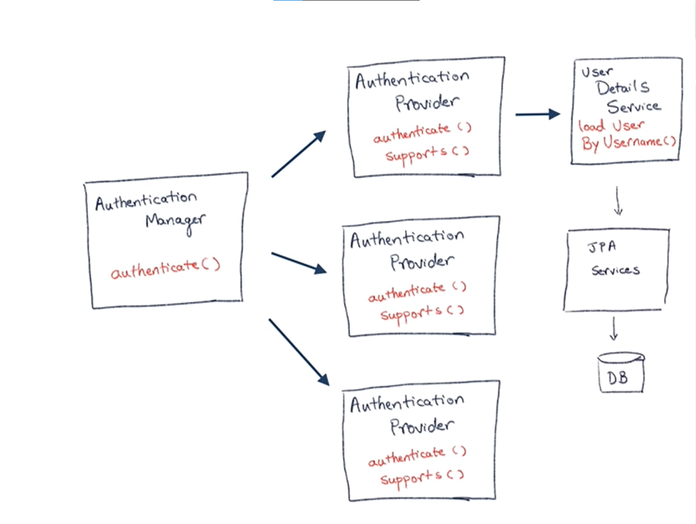

# Spring Security
---

## Adding with maeven Dependency

```
<dependency>
		<groupId>org.springframework.boot</groupId>
		<artifactId>spring-boot-starter-security</artifactId>
</dependency> 
```

Spring security will automatically add the basic level of security once we add the dependency, The basic level means that it asks for username and password to use all the services on the spring app

**Default username:** user

**Default password:** will be auto generated and displayed in log.

---

## Set static login credentials.

In application.properties
```
spring.security.user.name = new_user_name
spring.security.user.password = new_pass_word
```
---
## Inmemory User details using WebSecurityConfigurer Adapter (Authentication)

- Extend the class WebSecurityConfigurerAdapter.
- Override the configure method with "AuthenticationManagerBuilder" argument.
- Configure auth variable to use in memory auth with some user and password.
- Create a password enoder bean with spring expects to hash passwords.
- Use @EnableWebSecurity annotation to show this class is configuration of security.

```
@EnableWebSecurity
public class SpringSecurityConfig  extends WebSecurityConfigurerAdapter {

    @Override
    protected void configure(AuthenticationManagerBuilder auth) throws Exception {
        // super.configure(auth);
        auth.inMemoryAuthentication()
            .withUser("admin")
            .password("shadow12")
            .roles("Admin")
            .and()
            .withUser("user")
            .password("shadow12")
            .roles("User");
    }

    @Bean 
    public PasswordEncoder getPasswordEncoder() {
        return NoOpPasswordEncoder.getInstance();
    }
}
```

---
## Authorisation with diffirent roles(In memory + authorizations)

- Override the configure method with "HttpSecurity" argument.
- Configure the parameter for diffirent roles with diffirent endpoints


```
@EnableWebSecurity
public class SpringSecurityConfig  extends WebSecurityConfigurerAdapter {

    @Override
    protected void configure(AuthenticationManagerBuilder auth) throws Exception {
        // super.configure(auth);
        auth.inMemoryAuthentication()
            .withUser("admin")
            .password("shadow12")
            .roles("Admin")
            .and()
            .withUser("user")
            .password("shadow12")
            .roles("User");
    }

    
    @Bean 
    public PasswordEncoder getPasswordEncoder() {
        return NoOpPasswordEncoder.getInstance();
    }


    // Authorisation part

    @Override
    protected void configure(HttpSecurity http) throws Exception {        
        http.authorizeRequests()
            .antMatchers("/**").hasAnyRole("Admin").and().formLogin();
    }

}

```
---
## Spring security architecture


## Spring security architecture with JPA 




---
---
---
## Spring security Authentication with JPA 
> Architecture is very important. Please have a look at it.
```
@EnableWebSecurity
public class SpringSecurityConfig  extends WebSecurityConfigurerAdapter {

    @Autowired
    private UserDetailsService userDetailsService;

    @Override
    protected void configure(AuthenticationManagerBuilder auth) throws Exception {        
        auth.userDetailsService(userDetailsService);
    }

    @Bean 
    public PasswordEncoder getPasswordEncoder() {
        return NoOpPasswordEncoder.getInstance();
    }

    @Override
    protected void configure(HttpSecurity http) throws Exception {        
        http.authorizeRequests()
            .antMatchers("/admin").hasAnyRole("ADMIN")
            .antMatchers("/users").hasAnyRole("ADMIN,USERS")
            .antMatchers("/").permitAll()
            .and().formLogin();
    }
}
```

## Create MyUserDetailsServica Class extends UserDetailsService (Service layer)

> This Class is used in configure function in Configuration class.

>Must Override the method **loadUserByUsername(String username) throws UsernameNotFoundException**

>The Service layer uses UserRepository(JPA Repository) to retrive user from the database, Then the found user is returned as MyUserDetails Object for authentication purposes.

```
@Service
public class MyUserDetailsServica implements UserDetailsService{

    @Autowired
    UsersRepository usersRepository;

    @Override
    public UserDetails loadUserByUsername(String username) throws UsernameNotFoundException {      
        Optional<Users> user =   usersRepository.findByUsername(username);

        user.orElseThrow(() -> new UsernameNotFoundException("User not found with username: " + username));

        return user.map(MyUserDetails::new).get();
    }
    
}

```
---
## Create MyUserDetails class which extends UserDetails

> This class is considered as user to spring security so conversion of normal user to this usertype will occur in MyUserDetailsServica.

Implement all methods in UserDetails

```
public class MyUserDetails implements UserDetails {

    private String userName;
    private String password;
    private List<GrantedAuthority> authorities;
    private Boolean active;


    public MyUserDetails(Users user) {        
        this.userName = user.getUsername();
        this.password = user.getPassword();
        this.active = user.getIsEnabled();
        this.authorities = Arrays.asList(new SimpleGrantedAuthority("ROLE_" + user.getRole()));
        // System.out.println(user);
    }

    @Override
    public Collection<? extends GrantedAuthority> getAuthorities() {
        return authorities;
    }

    @Override
    public String getPassword() {
        return password;
    }

    @Override
    public String getUsername() {
        return userName;
    }

    @Override
    public boolean isAccountNonExpired() {
        return true;
    }

    @Override
    public boolean isAccountNonLocked() {
        return true;
    }

    @Override
    public boolean isCredentialsNonExpired() {
        return true;
    }

    @Override
    public boolean isEnabled() {
        return active;
    }

}


```

## The remaining parts are

    1. Create JPA Repository
    2. Create normal user structure
    3. Configure all connections of JPA with any DB's


