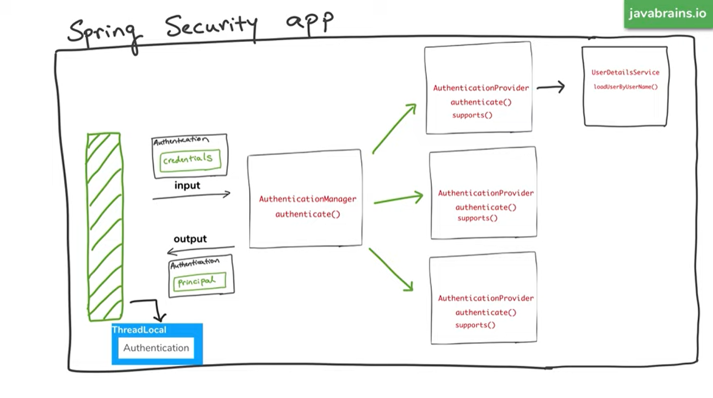

# Spring Security
---

## Adding with maeven Dependency

```
<dependency>
		<groupId>org.springframework.boot</groupId>
		<artifactId>spring-boot-starter-security</artifactId>
</dependency> 
```

Spring security will automatically add the basic level of security once we add the dependency, The basic level means that it asks for username and password to use all the services on the spring app

**Default username:** user

**Default password:** will be auto generated and displayed in log.

## Set static login credentials.

In application.properties
```
spring.security.user.name = new_user_name
spring.security.user.password = new_pass_word
```

## Inmemory User details using WebSecurityConfigurer Adapter (Authentication)

- Extend the class WebSecurityConfigurerAdapter.
- Override the configure method with "AuthenticationManagerBuilder" argument.
- Configure auth variable to use in memory auth with some user and password.
- Create a password enoder bean with spring expects to hash passwords.
- Use @EnableWebSecurity annotation to show this class is configuration of security.

```
@EnableWebSecurity
public class SpringSecurityConfig  extends WebSecurityConfigurerAdapter {

    @Override
    protected void configure(AuthenticationManagerBuilder auth) throws Exception {
        // super.configure(auth);
        auth.inMemoryAuthentication()
            .withUser("admin")
            .password("shadow12")
            .roles("Admin")
            .and()
            .withUser("user")
            .password("shadow12")
            .roles("User");
    }

    @Bean 
    public PasswordEncoder getPasswordEncoder() {
        return NoOpPasswordEncoder.getInstance();
    }
}
```


## Authorisation with diffirent roles

- Override the configure method with "HttpSecurity" argument.
- Configure the parameter for diffirent roles with diffirent endpoints


```
@EnableWebSecurity
public class SpringSecurityConfig  extends WebSecurityConfigurerAdapter {

    @Override
    protected void configure(AuthenticationManagerBuilder auth) throws Exception {
        // super.configure(auth);
        auth.inMemoryAuthentication()
            .withUser("admin")
            .password("shadow12")
            .roles("Admin")
            .and()
            .withUser("user")
            .password("shadow12")
            .roles("User");
    }

    
    @Bean 
    public PasswordEncoder getPasswordEncoder() {
        return NoOpPasswordEncoder.getInstance();
    }


    // Authorisation part

    @Override
    protected void configure(HttpSecurity http) throws Exception {        
        http.authorizeRequests()
            .antMatchers("/**").hasAnyRole("Admin").and().formLogin();
    }

}

```

## Spring security architecture




